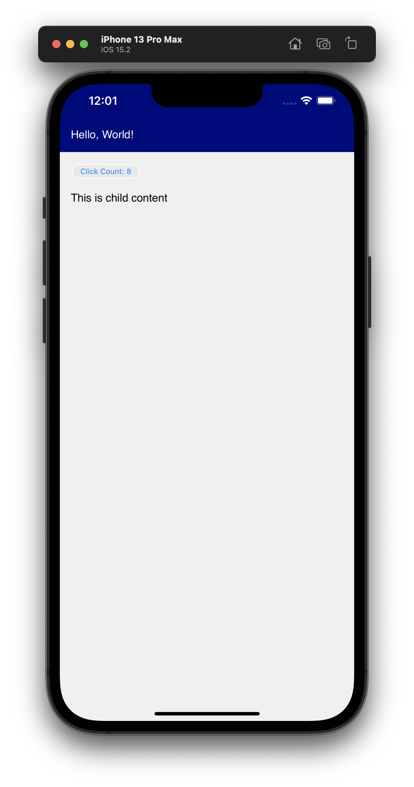
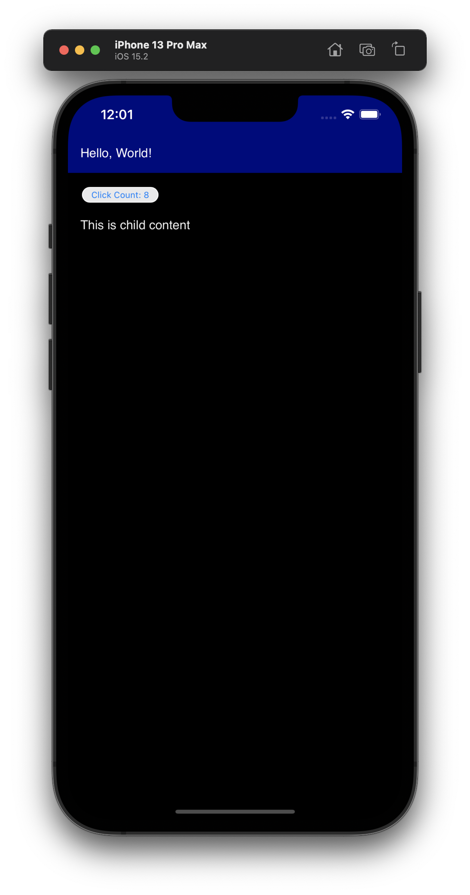

## Vite + Lit + Capacitor

[](https://github.com/rodydavis/vite-lit-capacitor/actions/workflows/ci.yml)

An example of Lit web component built with vite for use in capacitor.

[Demo](https://rodydavis.github.io/vite-lit-capacitor/)

## Features

- ✅ Typescript
- 🔥 Lit
- 🛠 Vite
- 🖥 Desktop
- 📱 iOS/Android
- 🌐 PWA

## Getting Started

To build the web folder and sync the assets:

```bash
npm run build
```

To run ios or android:

```bash
npm run start:ios
npm run start:android
```

To run desktop:
```bash
npm run open:desktop
```

To run web:

```bash
npm run dev
```

## Screenshots

  	 

## Links

- https://capacitorjs.com/
- https://webnative.tech/
- https://lit.dev/
- https://vitejs.dev/
- https://www.typescriptlang.org/
- https://web.dev/progressive-web-apps/
- https://github.com/rodydavis/lit-native
